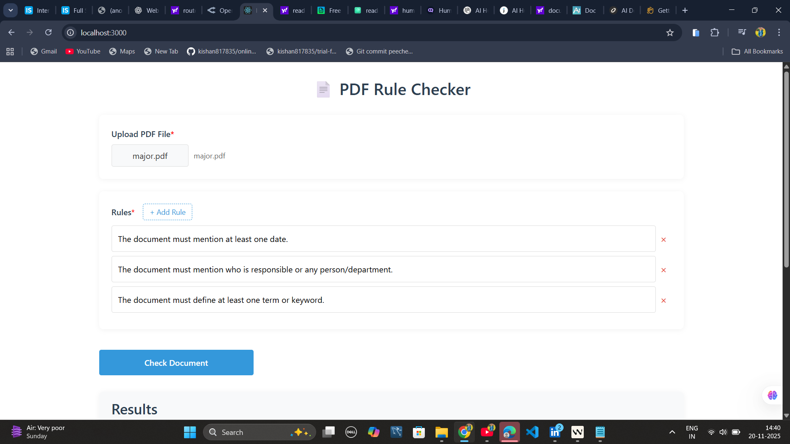

# PDF Rule Checker

A full-stack application that leverages AI to validate PDF documents against custom rules. Built as part of the NIYAMR AI .

## 🚀 Features

- **PDF Upload**: Securely upload and process PDF documents (2-10 pages)
- **Custom Rule Validation**: Define up to 3 custom rules for document validation
- **AI-Powered Analysis**: Utilizes GPT-4o-mini via OpenRouter for intelligent rule validation
- **Comprehensive Results**: Receive detailed feedback including:
  - Pass/Fail status
  - Supporting evidence
  - Clear reasoning
  - Confidence score (0-100)

## 📋 Example Rules

1. Document must include an effective date
2. Document must specify responsible parties
3. Document must define key terms
4. Document must include a revision history
5. Document must contain contact information

## 🛠️ Tech Stack

### Frontend
- React 18+ (JavaScript)
- Axios for API requests
- Bootstrap 5 for responsive UI
- React Dropzone for file uploads

### Backend
- Node.js with Express
- Multer for file upload handling
- pdf-parse for PDF text extraction
- OpenRouter API for LLM integration
- dotenv for environment management
- CORS for cross-origin requests

## 🚀 Getting Started

### Prerequisites
- Node.js 16+ and npm/yarn
- OpenRouter API key

### Installation

1. **Clone the repository**
   ```bash
   git clone <repository-url>
   cd your-project
   ```

2. **Backend Setup**
   ```bash
   cd backend
   npm install
   ```
   
   Create a `.env` file in the backend directory:
   ```env
   OPENROUTER_API_KEY=your_openrouter_api_key_here
   PORT=5000
   UPLOAD_FOLDER=./uploads
   ```

3. **Frontend Setup**
   ```bash
   cd ../frontend
   npm install

   ## 🖼️ UI Screenshot


   ```

### Running the Application

1. **Start the Backend**
   ```bash
   cd backend
   npm start
   ```
   The backend server will start on `http://localhost:5000`

2. **Start the Frontend**
   ```bash
   cd frontend
   npm start
   ```
   The application will be available at `http://localhost:3000`

## 📂 Project Structure

```
project-root/
├── backend/
│   ├── node_modules/
│   ├── uploads/           # Temporary storage for uploaded PDFs
│   ├── .env               # Environment variables
│   ├── llm.js            # LLM integration logic
│   ├── pdf.js            # PDF processing utilities
│   ├── server.js         # Express server configuration
│   └── package.json
└── frontend/
    ├── public/
    ├── src/
    │   ├── components/    # React components
    │   ├── services/      # API service layer
    │   ├── App.js
    │   └── index.js
    └── package.json
```

## 🔧 Configuration

### Environment Variables

#### Backend (`.env`)
- `OPENROUTER_API_KEY`: Your OpenRouter API key
- `PORT`: Server port (default: 5000)
- `UPLOAD_FOLDER`: Directory for temporary file storage

## 🤝 Contributing

1. Fork the repository
2. Create your feature branch (`git checkout -b feature/amazing-feature`)
3. Commit your changes (`git commit -m 'Add some amazing feature'`)
4. Push to the branch (`git push origin feature/amazing-feature`)
5. Open a Pull Request

## 📄 License

This project is licensed under the MIT License - see the [LICENSE](LICENSE) file for details.

## 🙏 Acknowledgments

- Built for NIYAMR AI 48-Hour Developer Assignment
- Uses OpenRouter for LLM access
- Special thanks to the open-source community for the amazing tools and libraries


Frontend runs on:

http://localhost:3000

How It Works (Simple Explanation)

User uploads a PDF

Backend extracts the text using pdf-parse

Frontend sends the rules + text to backend

Backend sends a prompt to the GPT-4o-mini model

The model responds in JSON

The frontend displays the results in a table

API Endpoints
POST /upload

Uploads the PDF file → returns extracted text.

POST /check-rules

Takes PDF text + rules → returns results array.

Example output:

{
  "rule": "Document must mention a date.",
  "status": "pass",
  "evidence": "Found on page 1: Published 2024",
  "reasoning": "A valid date is present.",
  "confidence": 92
}

Screenshot



Notes

The model used: openai/gpt-4o-mini

Max tokens are set low so it works on free OpenRouter credits

Simple UI with Bootstrap

Fully functional and easy to understand

Author

Built by Your Kishan Kumar for NIYAMR AI assignment.
